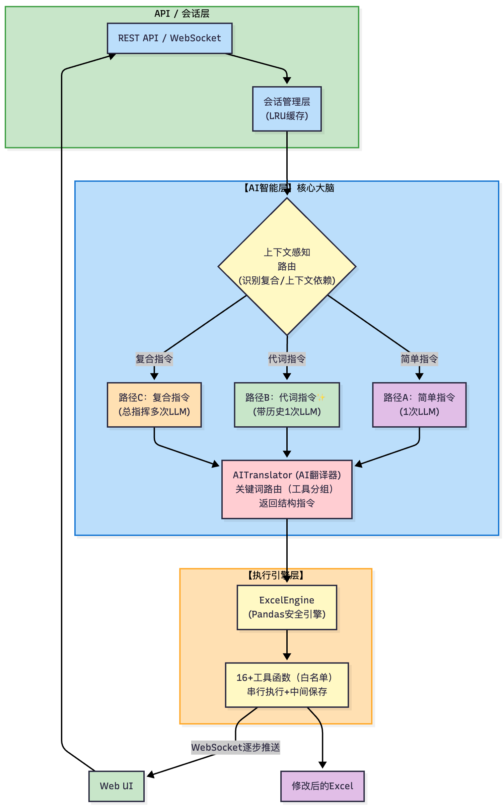

# 🧙 Merlin - AI Excel 助手

**用自然语言操作 Excel，低成本、高安全、真智能**

[](https://opensource.org/licenses/MIT)
[](https://www.python.org/downloads/)
[](https://www.docker.com/)
[](https://docs.docker.com/compose/)

> 让非技术人员通过自然语言"指挥" AI，自动完成 Excel 数据处理

---

## 💡 为什么选择 Merlin？

### 🎯 核心优势：高效、低成本、更安全

相比于"AI 生成代码并在虚拟机中执行"的"**代码解释器**"模式，Merlin 采用了更轻量、更安全的"**AI 指令翻译**"模式。

#### 1. **更低 Token 消耗** 💰

**代码解释器方案**：
```python
# AI 必须输出完整的 Python 代码（100+ Token）
df = pd.read_excel('file.xlsx')
df['总价'] = df['数量'] * df['单价'] * df['税率']
df.to_excel('output.xlsx', index=False)
```

**Merlin 方案**：

AI 只需输出轻量的 JSON 指令（~20 Token）
```json
{
  "function": "perform_math",
  "arguments": {"operation": "multiply", "...": "...."}
}
```

**结果**：Merlin 的单次操作 Token 消耗降低 **80-90%**，响应更快、成本更低。

#### 2. **智能路由架构** 🧠

Merlin 采用三层智能路由机制：

- **关键词路由**：通过关键词匹配，只发送相关工具（3-4 个），减少 **60-70% 输入 Token**
- **上下文感知路由** ⭐️ 新：检测代词（"它"、"它们"等 17 个标记），按需注入历史上下文
- **复杂指令拆分**：复合指令先由总指挥拆分，再逐个翻译，确保高精度串行执行

#### 3. **绝对安全** 🔒

| 方案 | AI 能做什么？ | 风险 |
|------|--------------|------|
| **代码解释器** | 执行任意 Python 代码 | ⚠️ 需要沙箱隔离，防止 `os.remove('/')` |
| **Merlin** | 只能调用预定义的安全函数 | ✅ 白名单机制，从根本上杜绝代码执行风险 |

AI 永远无法执行它"想"执行的代码，它只能"请求"调用你在 `excel_engine.py` 中预先审查过的函数。

#### 4. **代码与提示词分离** 📦

- 所有 AI 提示词、工具 Schema 外部化到 `YAML` 文件
- 优化 AI 性能**只需修改配置文件**，无需重新部署代码
- 便于 A/B 测试、多语言支持、版本管理

#### 5. **智能混合架构** ⚡

```
用户指令
    ↓
智能判断：复合？上下文依赖？
    ├─ 路径 A：简单 + 无上下文 → 直接翻译（不带历史）💨 最低成本
    ├─ 路径 B：简单 + 有上下文 → 直接翻译（带历史）🧩 理解代词
    └─ 路径 C：复合指令 → 总指挥拆分 → 逐个翻译 → 串行执行 🎯 高精度
```

**完美平衡**：
- 95% 简单指令走路径 A（超低成本）
- 代词指令自动走路径 B（准确理解"它们"）⭐️ 新
- 复杂指令走路径 C（确保质量）

---

## ✨ 核心特性

- 🎯 **零学习成本** - 用说话代替复杂的 Excel 公式
- 💰 **成本优化** - Token 消耗降低 60-90%，响应速度提升
- 🔒 **绝对安全** - 白名单机制，AI 无法执行任意代码
- 🧠 **真正智能** - 自动拆分复合指令，智能路由，主动功能发现
- 🧩 **上下文记忆** - 理解"它"、"它们"等代词，支持连续对话 ⭐️ 
- 🤝 **友好体验** - 智能建议、模糊匹配列名、结构化错误提示
- 📦 **易于维护** - 提示词、工具Schema、分组配置全部外部化到YAML
- 🎨 **UI 0.0.2** - 三栏式专业布局，可复制列名，内嵌下载按钮
- 🌊 **流式响应** - WebSocket实时推送，逐步显示进度，智能限流

---

## 🚀 快速开始

### 方式 1：Docker 部署（推荐）🐳

**适合**：快速部署、生产环境、不想配置环境

```bash
# 1. 克隆项目
git clone https://github.com/TJxiaobao/Merlin.git
cd Merlin

# 2. 配置环境变量
cp env.example .env
nano .env  # 填入你的 API Key

# 3. 启动服务（二选一）
docker compose up -d          # 使用 docker compose
# 或
make up                       # 使用 Makefile（更简单）

# 4. 访问应用
# 打开浏览器访问 http://localhost:8000
```

**常用命令**：
```bash
make logs        # 查看日志
make restart     # 重启服务
make down        # 停止服务
make update      # 更新并重启
make build-fast  # 快速构建（利用缓存）
```

> 💡 **构建优化提示**：
> - 首次构建约 2-3 分钟（已启用 BuildKit 加速）
> - 后续构建利用缓存，仅需 30-50 秒
> - 详见 [BUILD_OPTIMIZATION.md](BUILD_OPTIMIZATION.md)

**环境要求**：
- Docker 20.10+
- Docker Compose V2（集成在 Docker CLI 中）

---

### 方式 2：本地开发部署

**适合**：开发调试、功能定制、学习源码

#### 1. 环境准备

- Python 3.8+
- Node.js 16+
- npm 或 yarn

#### 2. 安装依赖

```bash
# 克隆项目
git clone https://github.com/your-username/Merlin.git
cd Merlin

# 安装 Python 依赖
pip install -r requirements.txt

# 安装前端依赖
cd frontend && npm install && cd ..
```

#### 3. 配置 API

**方式 A：使用配置向导（推荐）**
```bash
python setup.py
```

**方式 B：手动配置**
```bash
cp env.example .env
nano .env  # 编辑配置文件
```

`.env` 配置示例：
```env
OPENAI_API_KEY=your-api-key-here
OPENAI_API_BASE=https://api.moonshot.cn/v1
```

> 💡 **支持的 API 服务**：
> - Moonshot (Kimi)：`https://api.moonshot.cn/v1`
> - OpenAI：`https://api.openai.com/v1`
> - DeepSeek：`https://api.deepseek.com/v1`
> - 其他兼容 OpenAI 接口的服务

#### 4. 启动服务

**方式 A：一键启动（推荐）**
```bash
./start.sh  # 自动启动后端+前端，并打开浏览器
```

**方式 B：分别启动**
```bash
# 终端 1：启动后端
python -m uvicorn app.asgi:application --reload

# 终端 2：启动前端
cd frontend && npm run dev
```

#### 5. 访问应用

- **前端界面**：http://localhost:5173
- **API 文档**：http://localhost:8000/docs
- **健康检查**：http://localhost:8000/

#### 6. 停止服务

```bash
./stop.sh  # 停止所有服务
```

---

## 💡 使用示例

### 基础操作
```
"把所有税率设为 0.13"
"把设备类型是 Gateway 的价格设为 100"
```

### 数学计算
```
"新建总价列等于数量乘以单价"
"计算利润等于售价减去成本"
```

### 复合指令（自动拆分）
```
"把所有税率设为 0.13，然后新建总价列等于数量乘单价再乘税率"
→ Merlin 自动拆分为 2 个子任务并串行执行
```

### 上下文记忆（代词理解）⭐️ 
```
用户："把所有税率设为 0.13"
AI："✅ 已将'税率(填小数)'列的所有 228 行设置为: 0.13"

用户："把它们都改为 0.1 吧"
AI："✅ 已将'税率(填小数)'列的所有 228 行设置为: 0.1"
   （AI 自动理解"它们" = "税率列"）
```

### 数据清洗
```
"清理备注列的空格"
"把客户区域列里的北京都替换成华北区"
```

### 批量映射
```
"把 196001 的价格设为 100，196002 的设为 200"
→ 一次 AI 调用完成，不受 Rate Limit 影响
```

### 统计分析
```
"统计设备类型的分布"
"按客户区域分组，计算平均销售额"
```

> 💡 **发现更多功能**：点击界面上的 ✨ 魔法棒按钮，或输入 `help`

---

## 🏗️ 技术架构

### 核心设计理念



### 核心模块

| 模块 | 职责 | 技术亮点 |
|------|------|----------|
| **AI 翻译器** | 理解自然语言 → 结构化指令 | 三阶段架构：总指挥 + 路由器 + 专家 |
| **上下文感知路由** | 智能判断是否需要历史上下文 ⭐️ | 检测代词标记，按需注入历史，避免"自信幻觉" |
| **会话管理器** | 管理对话历史和上下文 ⭐️  | LRU 缓存，200 个并发会话，每个保留 3 轮对话 |
| **Excel 引擎** | 执行安全的 Pandas 操作 | 白名单机制，预定义函数，无代码执行风险 |
| **提示词管理器** | 加载和管理 AI 配置 | YAML 外部化，易于优化和版本管理 |
| **智能路由** | 根据指令复杂度选择路径 | 快速路径（关键词）+ 总指挥路径（拆分） |

### 为什么这样设计？

1. **AI 负责思考** - 理解自然语言，做出决策
2. **代码负责执行** - 安全可控，经过测试
3. **完全解耦** - AI 可替换，引擎可独立运行
4. **成本优化** - 智能路由，按需加载，避免浪费

---

## 🎬 支持的操作

### 数据操作
- ✅ 整列赋值、条件筛选、批量映射、列复制

### 数学计算
- ✅ 加减乘除、四舍五入、多列运算、自动处理非数字值

### 数据清洗
- ✅ 空格处理、空值填充、查找替换

### 统计分析
- ✅ 值分布、分组聚合、数据总结

### 文本处理
- ✅ 列合并、列拆分、大小写转换、日期提取

### 表格结构
- ✅ 去重、排序、删除列、重命名列

---

## 📂 项目结构

```
Merlin/
├── app/                        # 后端核心
│   ├── main.py                # FastAPI HTTP接口
│   ├── asgi.py                # ASGI应用入口（WebSocket集成）
│   ├── websocket.py           # WebSocket流式响应处理
│   ├── ai_translator.py       # AI 翻译器（三阶段架构 + 上下文感知）⭐️
│   ├── session_manager.py     # 会话管理器（上下文记忆）⭐️ 
│   ├── excel_engine.py        # Pandas 安全引擎
│   ├── prompts/               # AI 配置（完全外部化）
│   │   ├── merlin_v1.yml     # 系统提示词、错误消息、路由配置 ⭐️
│   │   ├── tools_schema.yml  # 工具Schema + 分组配置
│   │   └── manager.py        # 配置加载和管理
│   └── config.py              # 应用配置
├── frontend/                   # 前端（Vite + WebSocket）
│   ├── index.html             # 主页面
│   ├── main.js                # WebSocket客户端逻辑
│   ├── streaming.js           # 流式消息显示逻辑 ⭐️
│   ├── style.css              # UI 2.0样式
│   └── vite.config.js         # Vite配置
├── start.sh                   # 一键启动（后端+前端）
├── stop.sh                    # 停止服务
└── requirements.txt           # Python 依赖
```

---

## 🧪 测试

```bash
# 快速测试
python test.py quick

# 引擎测试（不调用 AI）
python test.py engine
```

---

## 🔧 常见问题

### Docker 部署相关

**Q: 端口 8000 被占用怎么办？**

修改 `docker-compose.yml` 中的端口映射：
```yaml
ports:
  - "8080:8000"  # 改为其他端口
```

**Q: 如何查看容器日志？**
```bash
make logs              # 推荐
# 或
docker compose logs -f
```

**Q: 如何进入容器调试？**
```bash
make shell             # 推荐
# 或
docker compose exec merlin /bin/bash
```

**Q: 上传的文件在哪里？**

文件存储在 `./uploads` 目录，通过 Docker 卷挂载持久化。

**Q: 如何更新到最新版本？**
```bash
git pull
make update            # 自动重新构建并重启
```

### 本地部署相关

**Q: 前端启动失败？**
```bash
# 重新安装依赖
cd frontend
rm -rf node_modules package-lock.json
npm install
npm run dev
```

**Q: 后端启动失败？**
```bash
# 检查依赖
pip install -r requirements.txt --upgrade

# 检查端口占用
lsof -i :8000
```

**Q: API Key 配置不生效？**

确保 `.env` 文件在项目根目录，且格式正确：
```env
OPENAI_API_KEY=sk-xxx  # 注意：等号两边不要有空格
OPENAI_API_BASE=https://api.moonshot.cn/v1
```

---

## 🛣️ 路线图

### ✅ v0.0.5（当前版本）
- **三阶段 AI 架构**（总指挥 + 路由器 + 专家）
  - 复合指令自动拆分和串行执行
  - 智能建议 + 模糊匹配列名
- **上下文感知路由** 🧩 ⭐️ 新
  - 理解"它"、"它们"等代词
  - 检测上下文依赖标记（17 个）
  - 按需注入历史上下文，避免"自信幻觉"
  - 三条路径：简单无上下文 / 简单有上下文 / 复合指令
- **会话记忆引擎** 🧠 ⭐️ 新
  - LRU 内存缓存（200 个并发会话）
  - 每个会话保留 3 轮对话（6 条消息）
  - 自动淘汰最久未使用的会话
  - 支持连续对话和代词理解
- **配置完全外部化** 🎯
  - 系统提示词 → `merlin_v1.yml`
  - 工具Schema → `tools_schema.yml`
  - 工具分组配置 → `tools_schema.yml` (tool_groups)
  - 智能路由配置 → `merlin_v1.yml` (intelligent_routing) ⭐️
  - 优化AI性能只需修改YAML，无需改代码
- **WebSocket 流式响应** 🌊
  - 实时显示每个子任务的翻译和执行进度
  - 智能限流：自动等待21秒避免API限流（RPM=3）
  - 倒计时显示，用户清楚知道等待原因
  - 中间结果保存，部分失败不丢数据
- **UI 0.0.2 升级**
  - 三栏式专业布局（顶部栏 + 左侧栏 + 主聊天区）
  - 可复制的列名列表（点击复制，自动插入）
  - 流式消息显示（在独立气泡中逐行更新）⭐️ 已修复
  - 智能空状态提示（动态建议）
  - 内嵌下载按钮（在成功消息中）

### 🚧 未来计划
- **v0.1.0** - 操作历史与撤销、批量文件处理
- **v0.2.0** - 多表格支持、规则模板、智能澄清对话
- **v1.0.0** - 公式引擎、完整文档、生产级优化

---

## 📊 性能对比

| 维度 | 代码解释器方案 | Merlin 方案 | 优势 |
|------|--------------|------------|------|
| **输出 Token** | ~100-200 (完整代码) | ~20-30 (JSON) | **降低 80-90%** |
| **输入 Token** | 所有工具 Schema | 智能路由，按需加载 | **降低 60-70%** |
| **上下文理解** | 需要每次都带完整历史 | 按需注入，检测代词 ⭐️ | **精准且低成本** |
| **安全性** | 需要沙箱隔离 | 白名单机制 | **从根本上安全** |
| **响应速度** | 慢（生成+执行代码） | 快（翻译+直接调用） | **提升 2-3 倍** |
| **可维护性** | 提示词嵌入代码 | YAML 外部化 | **易于优化** |

---

## 🤝 贡献

欢迎提交 Issue 和 Pull Request！

```bash
git checkout -b feature/AmazingFeature
git commit -m 'Add some AmazingFeature'
git push origin feature/AmazingFeature
```

---

## 📄 许可证

MIT License - 详见 [LICENSE](LICENSE) 文件

---

## 📮 联系方式

- **Issues**: [GitHub Issues](https://github.com/TJxiaobao/Merlin/issues)
- **Email**: gaoxingcun@apache.org

---

<p align="center">
  <strong>用 AI 的力量，让 Excel 操作变得简单、安全、高效！</strong><br>
  <br>
  如果觉得有用，请给个 ⭐️ Star 支持一下！
</p>
